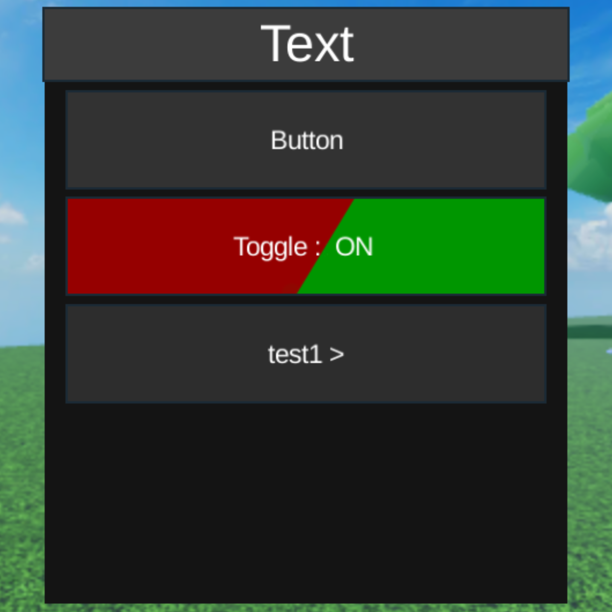

# How to Use DraLibs

## prepair
### installation
```
local dralibs = loadstring(game:HttpGet("https://raw.githubusercontent.com/INDRA969696/DrScriptHub/main/DraLibs?t="..tick()))()
```
### Create Window
```
MyHub:CreateWindow(Text)
```
## Function
### Button
```
MyHub:Create button(Text, Callback)
```
### Toggle
```
IndraLib:CreateToggle(Text, Callback)
```
### Notify
```
IndraLib:CreateNotify(Title, Text, Duration)
```
### Dropdown
```
IndraLib:CreateDropdown(Text, List, Callback
```

# DraLibs(the minimalist UI)
<table align="center" Border="0">
<tr>
  <td align="center">
    <br/>
    <sub><b>Main UI</b></sub>
  </td>
  <td align="center">
    <br/>
    <sub><b>Dropdown UI</b></sub>
  </td>
</tr>
</table>
